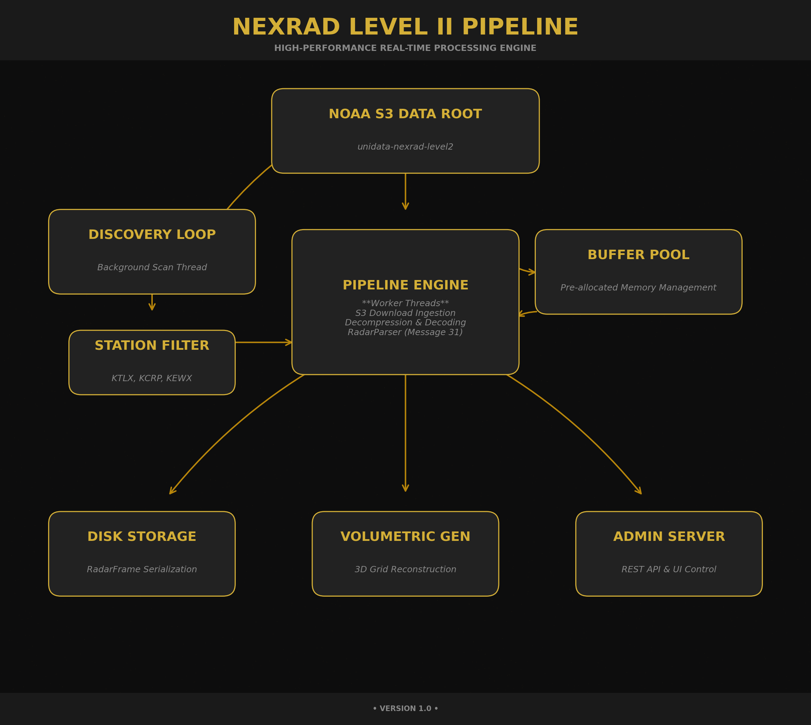

# NEXRAD Radar: Level II Processing Pipeline

**Disclaimer**: This project is maintained by a hobbyist, not an expert. The data processed is **not guaranteed** to match production NEXRAD applications 1:1. 

**Warning**: In its current state, this software **should not be used in production environments**. It is for research, experimentation, and educational purposes only.

### Overview
A high-performance C++ service for real-time fetching, decompressing, and processing NEXRAD Level II radar data from NOAA's public S3 buckets. Supports both 2D tilt-based and 3D volumetric output formats with bitmasked quantization.

### Features
- High-efficiency S3-based discovery of new radar frames.
- High-throughput multi-threaded processing with pre-allocated buffer pools.
- Configurable memory and CPU usage via CLI, Environment Variables, and HTTP API.
- Support for monitoring specific stations or "All Stations" mode.
- RESTful Admin API for metrics and configuration management.

---

## Hardware Requirements

> **Note:** The minimum requirements listed below are based on the actual hardware and operating systems the software has been tested with:
> - Intel i7-4600M (4 logical cores)
> - 16 GB RAM
> - Linux Mint and Ubuntu
>
> These values represent a *known-working baseline*, not a theoretical minimum.

### Minimum Requirements (Tested Baseline)
- **CPU:** 4-core x86_64 processor (e.g., Intel i7-4600M class)
- **Memory:** 16 GB RAM
- **Storage:** 128 GB SSD
- **Operating System:**
  - Linux Mint
  - Ubuntu
- **Network:** Stable broadband connection (for continuous S3 ingestion)

### Recommended Requirements
For higher throughput, lower latency, and handling more stations concurrently:

- **CPU:** 8+ cores (modern Ryzen or Intel Core i7/i9 class)
- **Memory:** 32 GB RAM or more
- **Storage:** NVMe SSD
- **Operating System:**
  - Ubuntu 22.04+ or equivalent modern Linux distribution
- **Network:** High-speed, low-latency internet connection

> Running in “All Stations” mode or enabling 3D volumetric output benefits significantly from additional CPU cores and memory.

---

### Documentation
- [Building the Project](./docs/BUILD.md)
- [Running the Service](./docs/RUNNING.md)
- [Admin API Guide](./docs/HTML.md)
- [Output Format & Processing](./docs/FILE_FORMAT.md)

### Contributing
Contributions are more than welcome! Whether it's bug fixes, performance optimizations, or new features, feel free to open a Pull Request or Issue.
