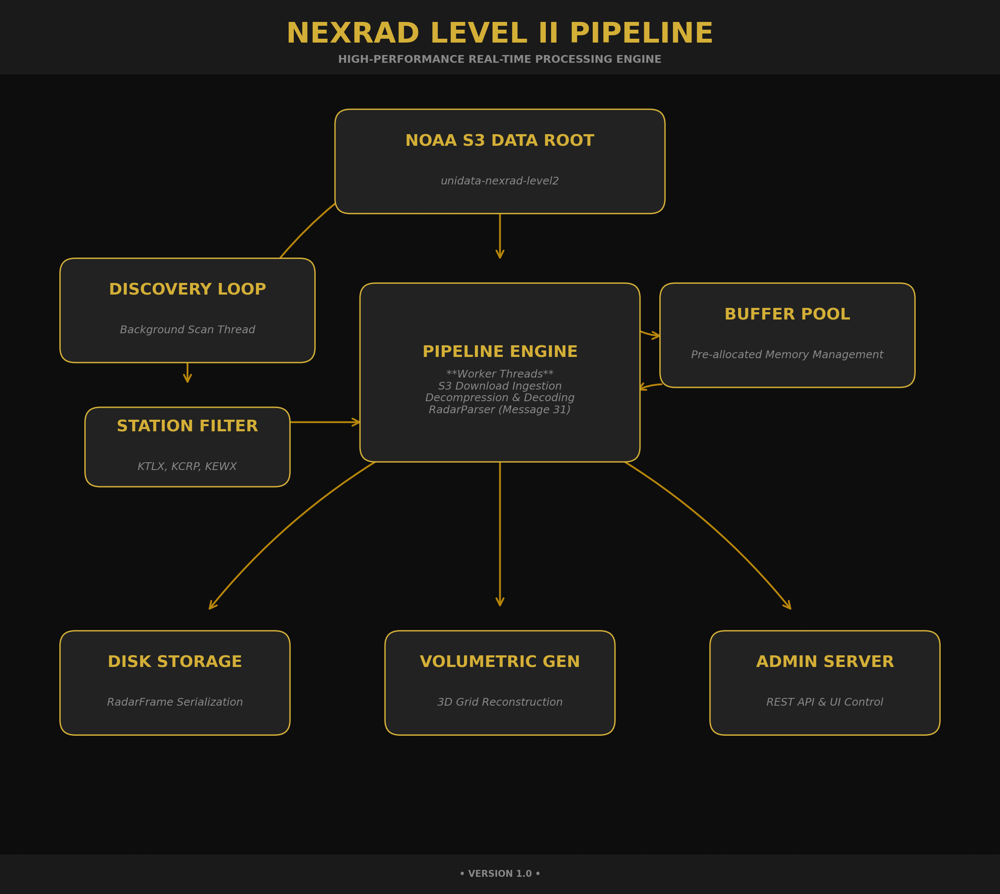

# NEXRAD Radar: Level II Processing Pipeline

**Disclaimer**: This project is an independent, community-driven implementation of a NEXRAD Level II processing backend. The output is **not guaranteed** to exactly match official or production-grade NEXRAD processing systems.

**Warning**: This software is currently in an **experimental** state and is under active development. It should **not** be used for operational, safety-critical, or production meteorological purposes. It is intended for research, experimentation, and educational use only.

## Overview

The NEXRAD Level II Radar Data Processing Pipeline is a self-hosted, high-performance backend for ingesting and processing NEXRAD Level II radar data. It is designed primarily for hobbyist and experimental radar applications, with a strong focus on performance, configurability, and simplicity of deployment.

The pipeline fetches raw radar data directly from public AWS buckets, handles decompression and decoding, and produces processed radar outputs suitable for visualization or further analysis. At present, the software supports **Archive2** data only.

This project was created to reduce the barrier to entry for radar experimentation. Building a functional NEXRAD processing backend requires navigating scattered documentation, legacy formats, and complex implementation details. This pipeline exists to save others that time by providing a working, reusable foundation for radar-based projects.

Rather than spending months assembling ingestion, decoding, and processing logic from scratch, developers can use this pipeline to focus on higher-level goals such as visualization, analytics, and user-facing applications.

Although experimental, the pipeline is optimized for speed and efficiency. It uses multi-threaded processing, pre-allocated buffer pools, and configurable resource limits to achieve very high throughput. With appropriate configuration, it can run on relatively low-powered systems, from small home servers to larger multi-station deployments.

The project is under active development and is evolving to support a wider range of use cases and users over time. Performance, stability, and feature coverage are continuously being improved.

It currently supports both:
- **2D tilt-based outputs**, and
- **3D volumetric outputs**,
using bitmasked quantization for compact and efficient data representation.

### Features
- High-efficiency S3-based discovery of new radar frames.
- High-throughput multi-threaded processing with pre-allocated buffer pools.
- Configurable memory and CPU usage via CLI, Environment Variables, and HTTP API.
- Support for monitoring specific stations or "All Stations" mode.
- RESTful Admin API for metrics and configuration management.

---

## Hardware Requirements

> **Note:** The minimum requirements listed below are based on the actual hardware and operating systems the software has been tested with:
> - Intel i7-4600M (4 logical cores)
> - 16 GB RAM
> - Linux Mint and Ubuntu
>
> These values represent a *known-working baseline*, not a theoretical minimum.

### Minimum Requirements (Tested Baseline)
- **CPU:** 4-core x86_64 processor (e.g., Intel i7-4600M class)
- **Memory:** 16 GB RAM
- **Storage:** 128 GB SSD
- **Operating System:**
  - Linux Mint
  - Ubuntu
- **Network:** Stable broadband connection (for continuous S3 ingestion)

### Recommended Requirements
For higher throughput, lower latency, and handling more stations concurrently:

- **CPU:** 8+ cores (modern Ryzen or Intel Core i7/i9 class)
- **Memory:** 32 GB RAM or more
- **Storage:** NVMe SSD
- **Operating System:**
  - Ubuntu 22.04+ or equivalent modern Linux distribution
- **Network:** High-speed, low-latency internet connection

> Running in “All Stations” mode or enabling 3D volumetric output benefits significantly from additional CPU cores and memory.

---

### Documentation
- [Building the Project](./docs/BUILD.md)
- [Running the Service](./docs/RUNNING.md)
- [Admin API Guide](./docs/HTTP.md)
- [Output Format & Processing](./docs/FILE_FORMAT.md)

### Contributing
Contributions are more than welcome! Whether it's bug fixes, performance optimizations, or new features, feel free to open a Pull Request or Issue.
